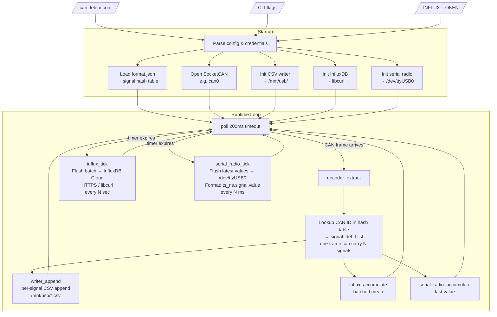

# can-telem-cloud

A lightweight C daemon for Raspberry Pi that reads raw CAN frames from a SocketCAN interface, decodes every signal defined in a JSON format file, and fans the data out to three independent sinks simultaneously:

| Sink | What it does |
|------|-------------|
| **CSV logger** | Writes one unified wide snapshot CSV (`telemetry_snapshot.csv`) every 500ms |
| **InfluxDB** | Batches samples and uploads to InfluxDB Cloud on a configurable interval |
| **Serial radio** | Periodically serializes the latest value of every active signal and writes it to a UART radio (e.g. RFD900A) for wireless ground-station reception |

The production mobile app reads the InfluxDB sink as long/tag telemetry:

```text
telemetry_snapshot,signal=<name> value=<number>
```

In that contract, the telemetry name comes from the `signal` tag and the
numeric reading comes from the `value` field.

---

## Architecture



---

## Hardware Setup

### Raspberry Pi 4 (driverio board)

| Component | Details |
|-----------|---------|
| CAN hat | MCP2515 on `can0`, 500 kbps |
| USB log drive | `ext4` mounted at `/mnt/usb` |
| RTC module | DS3231 on I2C (`dtoverlay=i2c-rtc,ds3231` in `/boot/firmware/config.txt`) |
| LTE modem | Quectel EG25-G on `/dev/ttyUSB1–4`; NTP via `systemd-timesyncd` for accurate timestamps |
| Serial radio | RFD900A on `/dev/ttyUSB0` (Silicon Labs CP2102); 115200 baud, NET\_ID 420 |

### Real-time clock (DS3231)

Telemetry timestamps come from `CLOCK_REALTIME`. On the driverio Pi, a DS3231 RTC keeps time when the vehicle is offline and seeds the system clock on boot.

Timekeeping flow:

1. **Boot:** kernel reads `/dev/rtc0` and sets system time.
2. **Online:** `systemd-timesyncd` syncs system time over NTP (LTE).
3. **Write-back:** system time is copied to the RTC hourly and on shutdown so the module stays accurate between power cycles.

Install the RTC sync units shipped in this repo:

```bash
sudo cp deploy/rtc-sync.service deploy/rtc-sync.timer deploy/rtc-sync-shutdown.service /etc/systemd/system/
sudo systemctl daemon-reload
sudo systemctl enable --now systemd-timesyncd rtc-sync.timer rtc-sync-shutdown.service
sudo hwclock --systohc --utc
```

Verify:

```bash
timedatectl status          # expect: System clock synchronized: yes
sudo hwclock --show --utc   # should match date -u within ~1 second
```

If the RTC has never been set (or lost its battery), set system time first, then write it to the hardware clock:

```bash
sudo timedatectl set-time "2026-06-12 14:00:00"
sudo hwclock --systohc --utc
```

### Internet connectivity (WiFi first, LTE fallback)

InfluxDB uploads require internet at boot. The Pi prefers any saved WiFi profile and falls back to the Quectel EG25-G LTE modem when no known network is in range.

Install the connectivity service:

```bash
sudo cp deploy/network-connect.default /etc/default/network-connect
sudo cp deploy/network-connect.service /etc/systemd/system/
chmod +x deploy/network-connect.sh
sudo nmcli connection modify lte connection.autoconnect no
sudo systemctl disable --now sc2-lte.service 2>/dev/null || true
sudo systemctl daemon-reload
sudo systemctl enable --now network-connect.service
```

Saved WiFi profiles (`nmcli connection show`) are tried automatically. LTE uses APN `fast.t-mobile.com` (Tello/T-Mobile) and can be overridden in `/etc/default/network-connect`.

Verify:

```bash
systemctl status network-connect.service
ip route show default
curl -s -o /dev/null -w "%{http_code}\n" https://us-east-1-1.aws.cloud2.influxdata.com/health
```

### Bring up CAN interface

```bash
sudo ip link set can0 up type can bitrate 500000
```

### Mount USB drive

```bash
sudo mkdir -p /mnt/usb
sudo mount /dev/sda1 /mnt/usb
```

Add to `/etc/fstab` for persistence:

```
UUID=<your-uuid>  /mnt/usb  ext4  defaults,noatime  0  2
```

---

## Building

```bash
sudo apt install libcurl4-openssl-dev libsqlite3-dev
make
```

The binary is `./can_telem`.

---

## Configuration

Copy and edit the example:

```bash
cp can_telem.conf.example can_telem.conf
```

### Full config reference

```ini
# ── Core ────────────────────────────────────────────────────────────
can_interface          = can0
format_file            = /home/sunpi/can-telem-cloud/sc-data-format/format.json
output_dir             = /mnt/usb

# ── InfluxDB Cloud (optional) ───────────────────────────────────────
influx_enabled         = true
influx_url             = https://us-east-1-1.aws.cloud2.influxdata.com
influx_org             = your-org
influx_bucket          = telemetry
influx_token           = your-token
influx_upload_interval_ms = 1000
influx_measurement     = telemetry_snapshot

# ── Serial radio (optional) ─────────────────────────────────────────
radio_enabled          = true
radio_device           = /dev/ttyUSB0
radio_baud             = 115200
radio_flush_interval_ms = 1000
```

The default InfluxDB measurement is `telemetry_snapshot`, which matches the
mobile app. Each uploaded reading is written as:

```text
telemetry_snapshot,signal=<signal_name> value=<number>
```

### CLI flags

```
can_telem [-c config] [-i interface] [-f format.json] [-o output_dir]
```

CLI flags override values in the config file.

---

## Signal format file

`format.json` (provided by the `sc-data-format` submodule) defines every signal:

```json
"signal_name": [<bytes>, "type", "units",
                <min>, <max>, "Category", "0xID",
                <bit_offset>, "source?", "db_key?",
                "tx_mode?", <tx_min_interval_ms?>]
```

---

## CSV output

One unified snapshot file at `<output_dir>/telemetry_snapshot.csv`:

```
timestamp_ns,value,raw_hex
1777013464503432008,3.412,3dad5b40
1777013464612834001,3.413,52ae5b40
```

`timestamp_ns` is a Unix nanosecond timestamp from `CLOCK_REALTIME` (synced via NTP over LTE).

---

## Serial radio output

The radio module flushes the **latest decoded value** for every active signal once per `radio_flush_interval_ms`. Each flush writes one line per signal to the serial port:

```
<timestamp_ns>,<signal_name>,<value>
```

Example flush frame (1-second window):

```
1777013464503432008,cell_group1_voltage,3.412
1777013464503432008,bms_input_voltage,19.2
1777013464503432008,bps_fault,0
```

### RFD900A setup notes

| Parameter | Value |
|-----------|-------|
| Baud (serial) | 115200 |
| Air data rate | 96 kbps |
| NET\_ID | 420 |
| MAVLINK mode | 0 (raw transparent) |
| RTSCTS | 0 |

Both ends must have identical settings. To verify:

```bash
# Enter AT command mode (1 s silence → +++ → 1 s silence)
stty -F /dev/ttyUSB0 115200 raw -echo cs8 -parenb -cstopb -crtscts
# then send: +++  (wait)  ATI5  (shows all settings)  ATO  (return to transparent)
```

---

## Running

```bash
# foreground
sudo ./can_telem -c can_telem.conf

# background (persistent across SSH sessions)
nohup sudo ./can_telem -c can_telem.conf > /tmp/can_telem.log 2>&1 &
```

---

## Source layout

```
can-telem-cloud/
├── src/
│   ├── main.c            — entry point, config init, signal handling
│   ├── config.[ch]       — config file parser
│   ├── format_loader.[ch]— format.json parser → signal hash table
│   ├── decoder.[ch]      — bit-exact CAN signal decoder
│   ├── can_reader.[ch]   — SocketCAN poll loop, fan-out to all sinks
│   ├── writer.[ch]       — CSV append sink
│   ├── influx.[ch]       — InfluxDB Cloud batch upload sink
│   ├── serial_radio.[ch] — UART radio sink (RFD900A / CP2102)
│   ├── gnss_reader.[ch]  — GNSS cache reader (lat/lon/elev injection)
│   ├── encoder.[ch]      — CAN signal encoder (for TX path)
│   └── db_watcher.[ch]   — SQLite DB watcher for TX signals
├── third_party/
│   └── cJSON.[ch]        — JSON parser
├── sc-data-format/       — git submodule containing format.json and format_exp.md
├── deploy/               — systemd unit files (RTC sync, network connect)
├── can_telem.conf.example
└── Makefile
```
