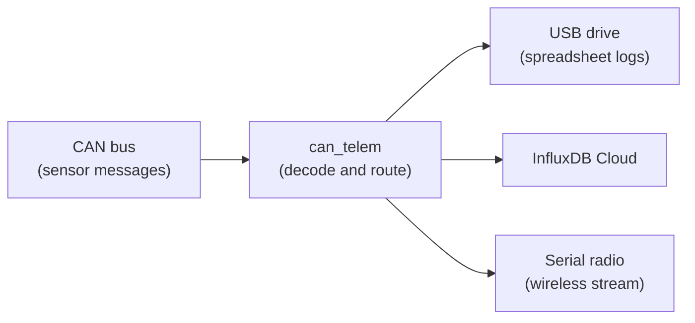
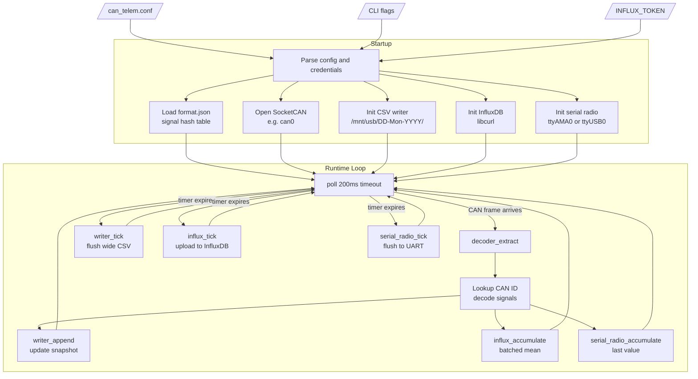

# can-telem-cloud

A lightweight C daemon for Raspberry Pi that reads raw CAN frames from a SocketCAN interface, decodes every signal defined in a JSON format file, and fans the data out to three independent sinks simultaneously:

| Sink | What it does |
|------|-------------|
| **CSV logger** | Writes wide snapshot CSVs under `{output_dir}/{DD-Mon-YYYY}/` every 500 ms (same column layout as the sc2-mobile-app export) |
| **InfluxDB** | Batches samples and uploads to InfluxDB Cloud on a configurable interval |
| **Serial radio** | Periodically serializes the latest value of every active signal and writes it to a UART radio (e.g. RFD900A) for wireless ground-station reception |

The production mobile app reads the InfluxDB sink as long/tag telemetry:

```text
telemetry_snapshot,signal=<name> value=<number>
```

In that contract, the telemetry name comes from the `signal` tag and the numeric reading comes from the `value` field.

---

## Architecture (simple)

If you are new to embedded telemetry, start here:



| Piece | Role |
|-------|------|
| **CAN bus** | Binary messages from car electronics (or a testbench mock) |
| **can_telem** | Looks up each message in `format.json`, extracts named values (SOC, speed, …) |
| **USB / Cloud / Radio** | Three copies of the same decoded data, formatted for different consumers |

The detailed diagram below shows config files, timers, and function names.

---

## Architecture (detailed)



---

## Hardware Setup

### Raspberry Pi 4 (driverio board)

| Component | Details |
|-----------|---------|
| CAN hat | MCP2515 on `can0`, 500 kbps |
| USB log drive | `ext4` mounted at `/mnt/usb` |
| RTC module | DS3231 on I2C (`dtoverlay=i2c-rtc,ds3231` in `/boot/firmware/config.txt`) |
| LTE modem | Quectel EG25-G on `/dev/ttyUSB1–4`; NTP via `systemd-timesyncd` for accurate timestamps |
| Serial radio | RFD900A on Pi UART `/dev/ttyAMA0` or CP2102 on `/dev/ttyUSB0`; 115200 baud, NET\_ID 420 |

### Real-time clock (DS3231)

Telemetry timestamps come from `CLOCK_REALTIME`. On the driverio Pi, a DS3231 RTC keeps time when the vehicle is offline and seeds the system clock on boot.

Timekeeping flow:

1. **Boot:** kernel reads `/dev/rtc0` and sets system time.
2. **Online:** `systemd-timesyncd` syncs system time over NTP (LTE).
3. **Write-back:** system time is copied to the RTC hourly and on shutdown so the module stays accurate between power cycles.

Install the RTC sync units shipped in this repo:

```bash
sudo cp deploy/rtc-sync.service deploy/rtc-sync.timer deploy/rtc-sync-shutdown.service /etc/systemd/system/
sudo systemctl daemon-reload
sudo systemctl enable --now systemd-timesyncd rtc-sync.timer rtc-sync-shutdown.service
sudo hwclock --systohc --utc
```

Verify:

```bash
timedatectl status          # expect: System clock synchronized: yes
sudo hwclock --show --utc   # should match date -u within ~1 second
```

### Internet connectivity (WiFi first, LTE fallback)

The Pi is configured to automatically manage both WiFi and LTE connections natively using NetworkManager, preferring WiFi when available.

Since the LTE modem runs in ECM (Ethernet Control Model) mode, it presents itself as a standard Ethernet card (`usb0`). To prevent `ModemManager` from conflicting with the interface or locking the serial ports (which are used by the GPS and status scripts), `ModemManager` is disabled and masked.

To install the LTE and WiFi network failover configuration:

```bash
# 1. Copy persistent NetworkManager and udev configs
sudo cp deploy/10-managed-devices.conf /etc/NetworkManager/conf.d/
sudo cp deploy/99-ignore-lte-net.rules /etc/udev/rules.d/

# 2. Reload and apply rules
sudo systemctl daemon-reload
sudo udevadm control --reload-rules
sudo udevadm trigger

# 3. Mask and stop ModemManager (prevents interface hijacking & serial locks)
sudo systemctl mask ModemManager
sudo systemctl stop ModemManager || true

# 4. Modify connection metrics in NetworkManager
# This configures WiFi to have priority (metric 100) and LTE to be the fallback (metric 600)
sudo nmcli connection modify lte connection.autoconnect yes ipv4.route-metric 600 ipv6.route-metric 600

# 5. Restart NetworkManager to apply
sudo systemctl restart NetworkManager
```

Verify:

```bash
nmcli dev
ip route show default
curl -s -o /dev/null -w "%{http_code}
" https://us-east-1-1.aws.cloud2.influxdata.com/health
```

### Bring up CAN interface

```bash
sudo ip link set can0 up type can bitrate 500000
```

### Mount USB drive

```bash
sudo mkdir -p /mnt/usb
sudo mount /dev/sda1 /mnt/usb
```

Add to `/etc/fstab` for persistence:

```
UUID=<your-uuid>  /mnt/usb  ext4  defaults,noatime  0  2
```

---

## Automated Image Building (GitHub Actions)

We have a GitHub Actions pipeline configured in `.github/workflows/build-image.yml` that automatically builds a pre-configured Raspberry Pi OS Lite image and publishes it in the **Releases** tab of your repository.

This image comes out-of-the-box with all packages installed, user accounts configured, CAN interfaces prepared, and LTE failover configurations deployed.

### Configuring Secrets
Before running the builder, go to **Settings > Secrets and variables > Actions** in your GitHub repository and add:
- **`PI_USERNAME`** (Optional): Custom username for the OS (defaults to `sunpi`).
- **`PI_PASSWORD`** (Optional): Custom password for the OS (defaults to `sunpi`).

### Triggering the Build
1. Go to the **Actions** tab of your repository.
2. Select the **Build Custom Raspberry Pi Image** workflow.
3. Click **Run workflow** and select the branch you wish to build.
4. If building for a release, publishing a new Release on GitHub will automatically trigger the build and attach the `.img.xz` file to the release page.

<details>
<summary><b>🚨 microSD Card Recovery Guide (Click to Expand)</b></summary>

In case your Raspberry Pi's microSD card becomes corrupted or fails, follow these steps to restore the system to a clean, pre-configured state:

#### 1. Download the Custom OS Image
* Go to the **Releases** tab of the `can-telem-cloud` repository on GitHub.
* Locate the latest release from the `main` branch.
* Download the compressed custom image asset: `driverio-custom-raspios-lite.img.xz`.

#### 2. Flash the Image
* Insert a new/blank microSD card into your laptop.
* Open the **Raspberry Pi Imager** software (or BalenaEtcher).
* For **Operating System**, select **Use Custom** and choose the downloaded `driverio-custom-raspios-lite.img.xz` file.
* For **Storage**, select your microSD card.
* Click **Write** and wait for the flashing and verification to complete.

#### 3. Boot the Pi
* Remove the microSD card from your laptop and insert it into the Raspberry Pi.
* Connect the CAN hat, LTE modem, and serial radio if they are not already connected.
* Power on the Raspberry Pi. The initial boot may take an extra minute as the OS automatically expands the filesystem.

#### 4. Log In
* Connect a monitor and keyboard, or log in via serial console.
* Log in using the default user credentials mentioned in our **Confluence docs**.
  * *Note: If a custom username/password was set in your GitHub secrets during the image build, use those custom credentials instead.*

#### 5. Authenticate Tailscale (Required)
Since Tailscale requires unique hardware node keys, you must manually authenticate the new OS install into your Tailnet:
* Run the Tailscale login command:
  ```bash
  sudo tailscale up
  ```
* Copy the login URL printed in the terminal, open it in your browser, and authenticate using your team's Gmail/Tailscale account.
* Once logged in, the Pi will join your Tailnet, and you can now SSH into it remotely (`ssh <username>@driverio`)!

</details>

---

## Building

```bash
sudo apt install libcurl4-openssl-dev libsqlite3-dev
make
```

The binary is `./can_telem`.

---

## Configuration

Copy and edit the example:

```bash
cp can_telem.conf.example can_telem.conf
```

### Full config reference

```ini
# ── Core ────────────────────────────────────────────────────────────
can_interface          = can0
format_file            = /home/sunpi/can-telem-cloud/sc-data-format/format.json
output_dir             = /mnt/usb

# ── InfluxDB Cloud (optional) ───────────────────────────────────────
influx_enabled         = true
influx_url             = https://us-east-1-1.aws.cloud2.influxdata.com
influx_org             = your-org
influx_bucket          = telemetry
influx_token           = your-token
influx_upload_interval_ms = 5000
influx_measurement     = telemetry_snapshot

# ── Serial radio (optional) ─────────────────────────────────────────
radio_enabled          = true
radio_device           = /dev/ttyAMA0
radio_baud             = 115200
radio_flush_interval_ms = 500

# ── GNSS cache (optional) ───────────────────────────────────────────
gnss_enabled           = true
gnss_cache_path        = /run/can_telem/gnss.json
gnss_poll_interval_ms  = 1000
```

The default InfluxDB measurement is `telemetry_snapshot`, which matches the mobile app. Each uploaded reading is written as:

```text
telemetry_snapshot,signal=<signal_name> value=<number>
```

### CLI flags

```
can_telem [-c config] [-i interface] [-f format.json] [-o output_dir]
```

CLI flags override values in the config file.

---

## Signal format file

`format.json` (provided by the `sc-data-format` submodule) defines every signal:

```json
"signal_name": [<bytes>, "type", "units",
                <min>, <max>, "Category", "0xID",
                <bit_offset>]
```

---

## CSV output

Wide snapshot files match the **sc2-mobile-app** web export format: one row per flush, one column per signal, sorted alphabetically.

### Directory layout

```
/mnt/usb/
  12-Jun-2026/
    telemetry_snapshot_14-30-05.csv
    telemetry_snapshot_18-02-11.csv   ← new file each can_telem restart
  13-Jun-2026/
    telemetry_snapshot_02-27-50.csv
```

| Part | Format | Example |
|------|--------|---------|
| Day folder | `DD-Mon-YYYY` | `02-Jun-2026`, `12-Jun-2026` |
| File name | `telemetry_snapshot_HH-MM-SS.csv` | Session start time (local) |
| First column | `timestamp_ms` | Unix epoch milliseconds |
| Other columns | Signal names (A–Z) | `soc`, `pack_voltage`, `mph`, … |

### Example

Header and one data row (truncated):

```csv
timestamp_ms,acc_in,mph,pack_voltage,soc,...
1781335399552,1.2,42.5,84.04,64.7,...
```

- Rows are written every **500 ms** (`WRITER_DEFAULT_SNAPSHOT_INTERVAL_MS`).
- Empty cells mean that signal has not been decoded yet in this session.
- If `can_telem` runs past midnight, it opens a new folder and file for the new day.

Timestamps use `CLOCK_REALTIME` (synced via NTP over LTE when online, or DS3231 RTC when offline).

---

## Serial radio output

The radio module flushes the **latest decoded value** for every active signal once per `radio_flush_interval_ms`. Each flush writes one line per signal to the serial port:

```
<timestamp_ns>,<signal_name>,<value>
```

Example flush:

```
1777013464503432008,cell_group1_voltage,3.412
1777013464503432008,bms_input_voltage,19.2
1777013464503432008,soc,64.7
```

### RFD900A setup notes

| Parameter | Value |
|-----------|-------|
| Baud (serial) | 115200 |
| Air data rate | 96 kbps |
| NET\_ID | 420 |
| MAVLINK mode | 0 (raw transparent) |
| RTSCTS | 0 |

Both ends must have identical settings. To verify:

```bash
# Enter AT command mode (1 s silence → +++ → 1 s silence)
stty -F /dev/ttyUSB0 115200 raw -echo cs8 -parenb -cstopb -crtscts
# then send: +++  (wait)  ATI5  (shows all settings)  ATO  (return to transparent)
```

---

## Running

```bash
# foreground
sudo ./can_telem -c can_telem.conf

# systemd (recommended on vehicle Pi)
sudo cp deploy/can-telem.service /etc/systemd/system/
sudo systemctl daemon-reload
sudo systemctl enable --now can-telem
```

Check logs:

```bash
journalctl -u can-telem -f
# expect: writer: logging snapshots to /mnt/usb/13-Jun-2026/telemetry_snapshot_02-27-50.csv
```

---

## Source layout

```
can-telem-cloud/
├── src/
│   ├── main.c            — entry point, config init, signal handling
│   ├── config.[ch]       — config file parser
│   ├── format_loader.[ch]— format.json parser → signal hash table
│   ├── decoder.[ch]      — bit-exact CAN signal decoder
│   ├── can_reader.[ch]   — SocketCAN poll loop, fan-out to all sinks
│   ├── writer.[ch]       — wide CSV snapshot sink (dated folders)
│   ├── influx.[ch]       — InfluxDB Cloud batch upload sink
│   ├── serial_radio.[ch] — UART radio sink (RFD900A / CP2102)
│   ├── gnss_reader.[ch]  — GNSS cache reader (lat/lon/elev injection)
│   ├── encoder.[ch]      — CAN signal encoder (for TX path)
│   └── db_watcher.[ch]   — SQLite DB watcher for TX signals
├── third_party/
│   └── cJSON.[ch]        — JSON parser
├── sc-data-format/       — git submodule containing format.json
├── deploy/               — systemd unit files (RTC sync, network connect, can-telem)
├── can_telem.conf.example
└── Makefile
```
